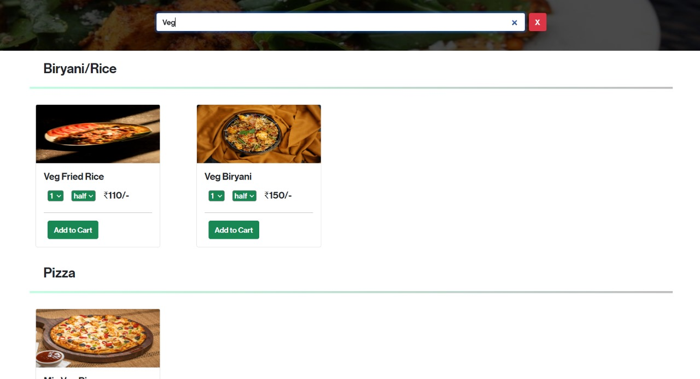

# Foodify

Foodify is a MERN stack-based restaurant website that allows users to browse, order, and manage their meals seamlessly. The application is fully responsive and uses Bootstrap for styling, ensuring a consistent and polished user experience across devices.

## Getting Started with Create React App

This project was bootstrapped with [Create React App](https://github.com/facebook/create-react-app).

## Screenshots

1. **Home Page**
   

2. **Signup Page**
   

3. **Login Page**
   

4. **My Orders Page**
   

## Features

- **Home Page**: Browse a variety of dishes displayed in a visually appealing carousel and card layout.
- **Signup & Login**: Secure authentication system with passwords hashed using `jsonwebtoken` and stored in MongoDB Atlas.
- **My Orders**: View and manage past orders.
- **Cart**: Add, remove, and view items in the cart.
- **Components**: Includes Navbar, Footer, Carousel, and Card components for a modular structure.

## Technologies Used

- **Frontend**: React, Bootstrap
- **Backend**: Node.js, Express.js
- **Database**: MongoDB Atlas
- **Authentication**: JSON Web Tokens (JWT)

## Deployment

The application is deployed and can be accessed at [Foodify](https://foodify-website.onrender.com/).

## Available Scripts

In the project directory, you can run. Firstly change the frontend and backend address to localhost:{port} you are using. Then:

### `npm run start`

Runs the app in the development mode.\
Open [http://localhost:3000](http://localhost:3000) to view it in your browser using [npm run start].

The page will reload when you make changes.\
You may also see any lint errors in the console.

### `node index.js`

Runs the app in the development mode.\
Open backend folder using [cd/backend] and then run [node/nodemon index.js]  to start [http://localhost:5000](http://localhost:5000) and view it in your browser.

The page will reload when you make changes.\
You may also see any lint errors in the console.

### `npm run build`

Builds the app for production to the `build` folder.\
It correctly bundles React in production mode and optimizes the build for the best performance.

The build is minified and the filenames include the hashes.\
Your app is ready to be deployed!

